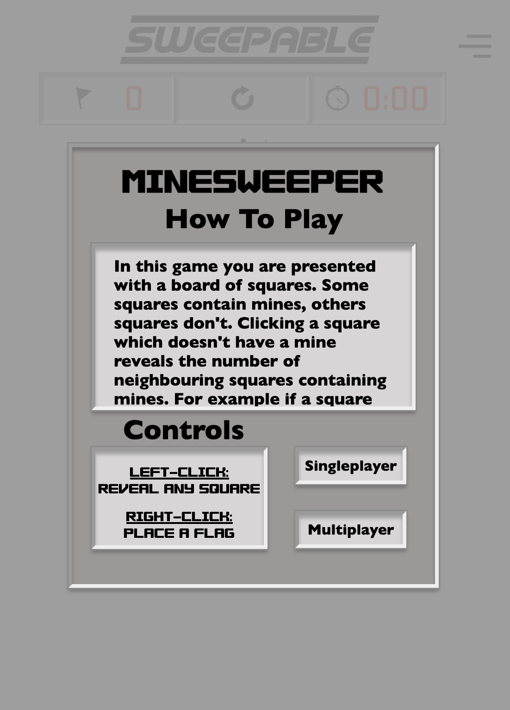

# Sweepable: Multiplayer Minesweeper

Play now: [sweepable.up.railway.app](https://sweepable.up.railway.app)

## What is it?
Sweepable is a modern, multiplayer recreation of the classic puzzle game, Minesweeper. It brings the nostalgic logic-based gameplay you know and love, but adds the thrilling ability to play alongside friends. Whether you want to test your solo sweeping skills or challenge a friend to a sweeping showdown, Sweepable has you covered.

## Single Player
You can enjoy Sweepable completely solo! The goal remains the same as the classic game: uncover all the safe squares without detonating any hidden mines. Use the numbers revealed on safe squares to deduce where the mines are hiding and flag them. 

### Difficulties
Sweepable features standard Minesweeper difficulties to test players of all skill levels:
* **Beginner:** A smaller grid (typically 9x9) with 10 mines. Perfect for learning the ropes and quick games.
* **Intermediate:** A medium grid (typically 16x16) with 40 mines. A solid challenge for experienced players.
* **Expert:** A large grid (typically 30x16) with 99 mines. For seasoned sweepers looking for the ultimate test of logic.

## Multiplayer
Take the classic game and make it social! You can play Sweepable with a friend in real-time.

### How to Play with a Friend
1. **Create a Room:** One player hosts a multiplayer session by creating a room.
2. **Share the Invite:** The host will receive a unique room code or invite link. Share this with your friend.
3. **Join the Game:** The second player enters the room code or clicks the invite link to join the session.
4. **Sweep:** Play together simultaneously! Depending on the game mode, you can work cooperatively to clear the board, or compete to see who can uncover the most safe tiles or find the most mines before detonating one.
